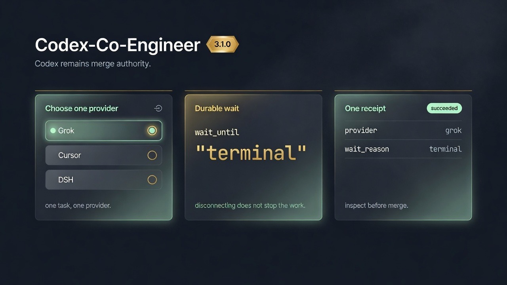
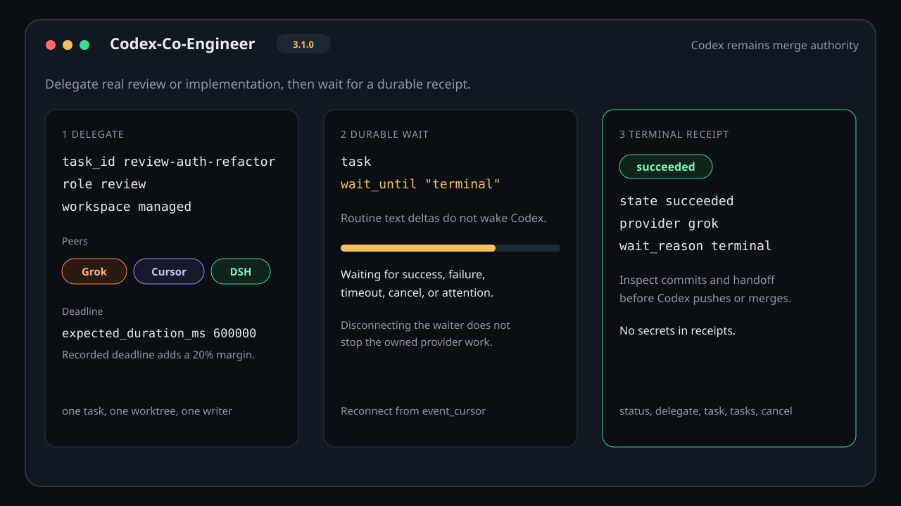

# Codex-Co-Engineer

[](https://github.com/ajhcs/Codex-Co-Engineer/actions/workflows/ci.yml)
[](https://github.com/ajhcs/Codex-Co-Engineer/releases/latest)
[](https://nodejs.org/)
[](LICENSE)

**Codex-Co-Engineer 3.1.1** lets Codex delegate real review and
implementation work to authenticated peer coding agents — Grok Build,
Cursor Local, Cursor Cloud, and DeepSeek Harness (DSH) — then wait for a
durable receipt instead of polling routine text.

Codex stays the chief engineer, reviewer, and merge authority. The
stable machine identifier is `codex-co-engineer`. In-repo release notes:
[docs/releases/v3.1.1.md](docs/releases/v3.1.1.md).





## First 60 seconds

### 1. Copy, paste, install

Requires Node.js 24+, Git, and Codex CLI. Local providers also need
Linux `systemd --user`, `systemd-run` 244 or newer, unified cgroup v2,
and `worktree-bootstrap` on `PATH`.

```bash
git clone https://github.com/ajhcs/Codex-Co-Engineer.git
cd Codex-Co-Engineer
codex plugin marketplace add "$PWD"
codex plugin add codex-co-engineer@codex-co-engineer
npm --prefix plugins/codex-co-engineer run setup
npm --prefix plugins/codex-co-engineer run setup:check
```

`npm run setup` installs pinned ACPX `0.13.0`, Cursor SDK `1.0.28`, and
the cohesive DSH `0.1.0-rc.7` composition. It does not log you into
Grok, Cursor Local, or Cursor Cloud. `setup:check` verifies those pinned
packages plus `worktree-bootstrap`. Start a **new** Codex session after
the plugin add.

### 2. Sign in once (only the providers you will use)

```bash
grok login
cursor-agent login
plugins/codex-co-engineer/bin/set-model-api-key
```

Cursor Cloud uses `CURSOR_API_KEY`, `CURSOR_API_KEY_FILE`, or the
owner-only `~/.config/cursor-cloud-control/api-key`. DSH uses
`MODEL_API_KEY`, `CODEX_CO_ENGINEER_MODEL_API_KEY_FILE`, or
`~/.config/codex-co-engineer/model-api-key`. Never put credentials in
MCP arguments or prompts.

### 3. First run

In the new Codex session:

> Show Codex-Co-Engineer status.

Local providers are ready only when `local_boundary.ready` is true. Then
delegate and wait:

```json
{
  "task_id": "review-auth-refactor",
  "provider": "grok",
  "repo": "/absolute/path/to/git-worktree",
  "role": "review",
  "workspace_mode": "managed",
  "prompt": "Review the current branch and report concrete correctness risks.",
  "expected_duration_ms": 600000
}
```

```json
{
  "task_id": "review-auth-refactor",
  "wait_until": "terminal"
}
```

Inspect the receipt before Codex pushes, opens a PR, or merges.

The repository argument is the literal MCP property `repo`. Always send it as
`"repo": "/absolute/path/to/git-worktree"`; `git_root`, `repository`, and
other aliases are unknown properties and fail schema validation. Cursor Cloud
also requires `repo` for the clean local checkout. Its pushed immutable commit
SHA is a separate, Cursor Cloud-only `starting_ref` property.

## What Codex-Co-Engineer is for

Use Codex-Co-Engineer when you want Codex to:

- run a review or implementation on Grok Build, Cursor Local, Cursor Cloud, or
  DeepSeek Harness (DSH) / Muse Spark
- keep one writer per managed local worktree and branch
- wait on a durable receipt instead of a fire-and-forget shell job
- cancel an owned local process group or Cursor Cloud run
- inspect the result before Codex pushes, opens a PR, or merges

Do not use it as a security sandbox, a credential broker, or a replacement for
the provider's own login and approval flow.

Version 3.1.1 exposes five tools: `status`, `delegate`, `task`, `tasks`,
and `cancel`. `delegate` records `expected_duration_ms` or `timeout_ms`
and a 20% deadline margin. `task` can wait with `wait_until: "terminal"`
until the recorded deadline, inspect summary/diagnostics views, extend a
deadline with an explicit reason, and deliver a same-session reply. It
does not push unsolicited stdio callbacks across assistant turns.

The bundled skill is `control-codex-co-engineer-agents`.

## Efficient coordination for the upcoming 3.2 release

For parallel work, delegate each independent change once, then coordinate the
result set with one `tasks` wait-any call instead of polling every task. Use
`status` and `task` compact views for routine decisions; open diagnostics pages
only when a task needs attention or fails. Wait-any returns bounded task
snapshots and live event previews; its `progress.detail_hint` points to the
single-task call when full event detail is needed. Clients that consume
`structuredContent` can opt into `response_mode: "structured"` to avoid a
second full receipt in the text fallback. Text-only clients should omit it;
omission preserves the exact legacy text response. These APIs are part of the
upcoming, unreleased 3.2 release until the package version is bumped.

The compact single-task projection is capped at 8,192 UTF-8 bytes by the MCP
server. That is a server payload guarantee, not a measured or claimed hard
limit in the Codex desktop renderer. See the
[efficient dogfood workflow](docs/efficient-dogfood.md) for request examples,
pagination rules, terminal evidence metadata, and Cursor Cloud preflight.

## Provider matrix

| Provider | Identifier | Transport | Workspace | Local process boundary |
| --- | --- | --- | --- | --- |
| Grok Build | `grok` | ACP first; CLI fallback only before prompt dispatch | Managed worktree by default, or explicit `direct` | Required |
| Cursor Local | `cursor-local` | ACP first; CLI fallback only before prompt dispatch | Managed worktree by default, or explicit `direct` | Required |
| DeepSeek Harness / Muse | `dsh` | Official rc.7 ACP composition through ACPX | Managed worktree by default, or explicit `direct` | Required |
| Cursor Cloud | `cursor-cloud` | Official Cursor SDK | Remote provider branch; no local worktree | Not used |

Roles are `review` and `implement`. An accepted prompt is never replayed
through another transport. ACPX does not provide an authoritative prompt-sent
acknowledgement, so a DSH task is marked `dispatch_uncertain` as soon as ACPX
spawns and is never replayed through CLI.

## Safety and workspace model

Local workers are launched as manager-owned transient `systemd --user`
services with `KillMode=control-group` solely so cancellation reaches detached
descendants and the worker survives the launching client. This is a
lifecycle/cleanup boundary, not a sandbox: providers inherit the normal
environment, network, filesystem, credentials, and shell capabilities. Local
dispatch fails closed when the Linux systemd/cgroup prerequisite is not
available. The check occurs before Codex-Co-Engineer creates a managed
worktree, task receipt, or prompt file. Cursor Cloud runs in the provider's
remote environment and does not depend on the local process boundary.

Cursor Local and DSH's official fallback CLIs take the prompt positionally, so
it may be visible to other processes running as the same Unix user for the
duration of that fallback. Grok fallback uses an owner-only prompt file.

### Local workspace modes

Local providers accept `workspace_mode`:

- `managed` (default) creates and locks one `worktree-bootstrap` worktree and
  branch per task. This is the normal mode for parallel implementation and
  review.
- `direct` runs against the supplied checkout. Use it only when you
  explicitly accept direct mutation of that checkout.

The invariant for managed tasks is:

```text
one task → one worktree → one branch → one writer
```

If `worktree-bootstrap` fails before returning an authoritative receipt and
path, Codex-Co-Engineer does not guess at or delete an unknown worktree.
Inspect the repository with `git worktree list` and the `worktree-bootstrap`
lock tooling; clean only an exact task/lock that the tooling identifies.

### Cursor Cloud requirements

Cursor Cloud does not use a local worktree. The supplied repository must have
an origin that Cursor can access, and `starting_ref` must be an exact,
immutable commit SHA that has already been pushed to that origin. This avoids
silently sending a different local branch state to the remote provider.

An exact SHA that is reachable only from a feature branch can still be
invisible to Cursor until that branch is provider-visible through an open
pull request or the default branch. Create the draft PR (or make the commit
reachable from the default branch) before final Cloud acceptance. If Cursor
returns HTTP 400 for an otherwise-valid SHA, surface it as a provider
visibility failure in the receipt and fix reachability before retrying; do not
blindly replay the task.

`create_pr` is a Cursor Cloud-only option and defaults to `false`. Local
tasks reject it. A local implementation returns its branch and handoff for
Codex to inspect; Codex may push and open a PR only after confirming that real
commits exist. Codex controls the final merge.

## Examples

Local review:

```json
{
  "task_id": "review-auth-refactor",
  "provider": "grok",
  "repo": "/absolute/path/to/git-worktree",
  "role": "review",
  "workspace_mode": "managed",
  "prompt": "Review the current branch and report concrete correctness risks.",
  "expected_duration_ms": 3000000,
  "timeout_ms": 3600000
}
```

Cursor Cloud implementation:

```json
{
  "task_id": "cloud-auth-refactor",
  "provider": "cursor-cloud",
  "repo": "/absolute/path/to/clean-checkout",
  "role": "implement",
  "starting_ref": "0123456789abcdef0123456789abcdef01234567",
  "prompt": "Implement the requested change, run tests, and commit the result.",
  "expected_duration_ms": 3600000,
  "create_pr": true
}
```

## Handoff and cleanup

Terminal managed tasks retain their worktree and branch for Codex inspection;
they are not silently deleted. Watch with `task` (`wait_until: "terminal"` plus optional `cursor`), then
run the authoritative handoff from the recorded worktree:

```bash
worktree-bootstrap handoff TASK --repo /absolute/worktree --format markdown
```

Inspect commits, diff, tests, and ownership evidence before pushing or opening
a PR. After merge or deliberate discard:

```bash
worktree-bootstrap lock inspect TASK --repo /absolute/worktree
worktree-bootstrap lock clean TASK --repo /absolute/worktree \
  --policy dead-local --lock-id LOCK_ID
git worktree remove /absolute/worktree
```

Clean only the exact corresponding branch and terminal task-state directory
after its receipt is no longer needed. Direct tasks have no managed worktree;
review their caller checkout explicitly. Cursor Cloud agents are archived
after terminal completion where supported, while their remote branch/PR
remains for Codex review.

## Data and credentials

Selecting a provider authorizes the task prompt and repository content to be
sent to that provider. Private repositories are supported when the configured
provider is authorized to review them. Provider children inherit the user's
normal authenticated environment because they are trusted peer coding agents.

Task prompts, events, logs, runtime identities, local paths, branch names, and
opaque provider IDs are stored under the owner-only state directory, normally
`$XDG_STATE_HOME/codex-co-engineer` or `~/.local/state/codex-co-engineer`.
Task directories are `0700`; files are `0600`. Prompts and session data are
retained for inspection until the operator removes the exact terminal task
state. See [data handling](docs/data-handling.md).

## Troubleshooting

**How do I check whether Codex-Co-Engineer can dispatch locally?**
Call `status`. Local providers are ready only when `local_boundary.ready` is
true. If it is false, the MCP process is missing Linux `systemd --user`,
`systemd-run` 244+, unified cgroup v2, or the forwarded user-session locators
(`XDG_RUNTIME_DIR`, `DBUS_SESSION_BUS_ADDRESS`).

**Setup passed, but local providers are unavailable.**
`setup:check` does not prove the MCP environment. Re-run `status` from the
actual MCP server process, then confirm the plugin `.mcp.json` allowlist
forwards `HOME`, `PATH`, `XDG_*`, and `DBUS_SESSION_BUS_ADDRESS`.

**Where is the installed plugin?**
After `codex plugin add codex-co-engineer@codex-co-engineer`, Codex reports
the cached install path. The source package in this repository is
`plugins/codex-co-engineer`. Run `npm run setup` from that source package
(or with `npm --prefix plugins/codex-co-engineer`) rather than guessing a
cache path.

**A managed worktree appeared without a receipt.**
Do not guess or delete it. Inspect `git worktree list` and
`worktree-bootstrap lock inspect`, then clean only an exact identified
task/lock.

**Cursor Cloud returned HTTP 400 for a valid SHA.**
Treat it as a provider visibility failure. Make the commit reachable from an
open PR or the default branch, then retry. Do not replay a prompt that was
already dispatched.

**Can I put API keys in the MCP tool arguments?**
No. Use normal provider login or the owner-only key files. Credentials must
not appear in MCP arguments, prompts, receipts, fixtures, or Git.

## Development and release

```bash
npm --prefix plugins/codex-co-engineer test
node scripts/validate-release.mjs
node scripts/inspector-preflight.mjs
```

The authoritative release gate runs against one exact local candidate using
Node 24. GitHub Actions is a credential-free mirror; live Grok, Cursor,
Cursor Cloud, and DSH acceptance is recorded separately because CI must not
send repository content to model providers.

GitHub-ready 3.1.1 notes live in [docs/releases/v3.1.1.md](docs/releases/v3.1.1.md).
This repository does not create the GitHub Release, tag, or remote from that
file.

The older `cursor-cloud-control` package remains in this repository as a
compatibility plugin for existing installations. New installations need only
Codex-Co-Engineer 3.x.

## License

MIT. See [LICENSE](LICENSE).
