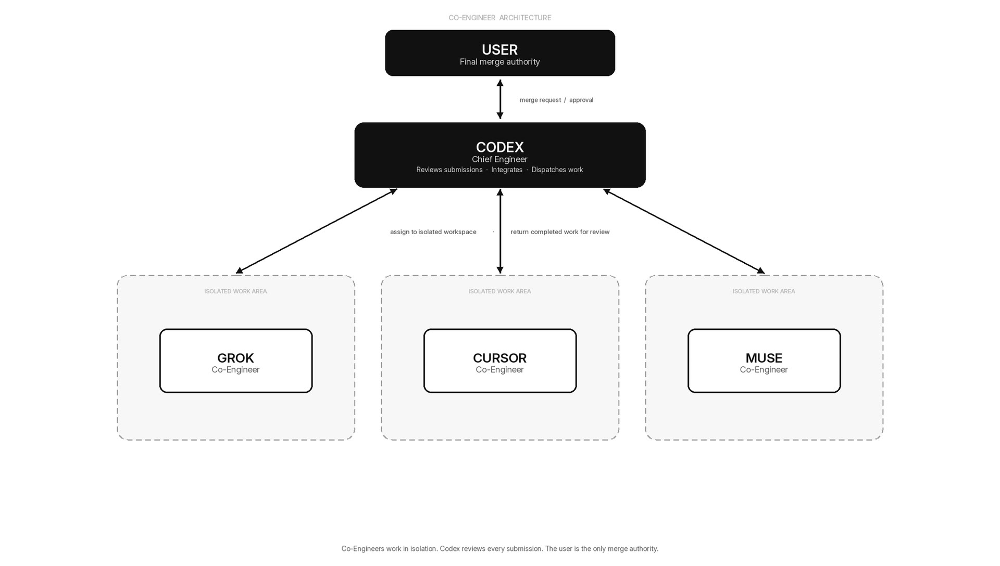
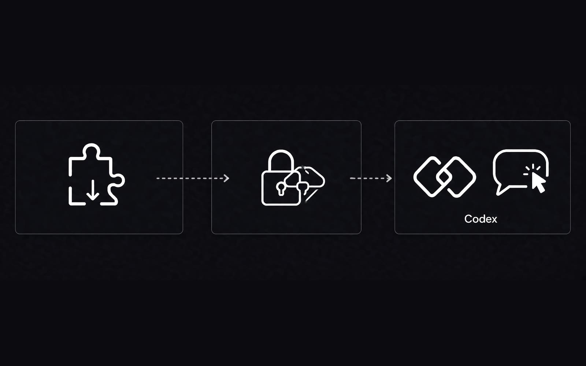
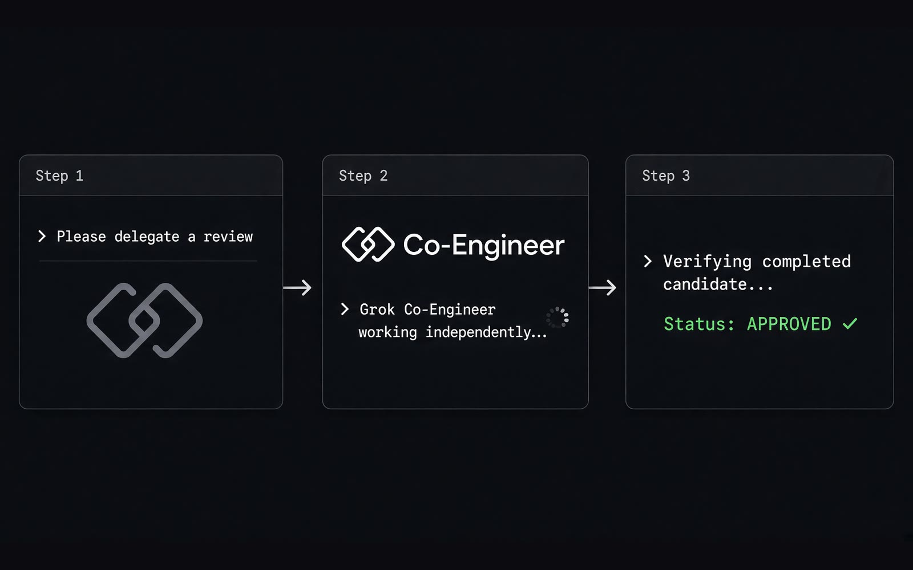
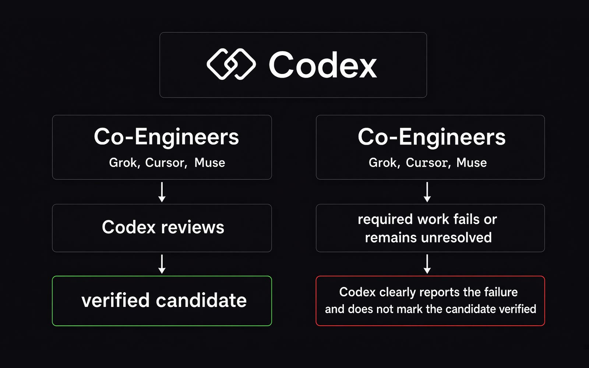
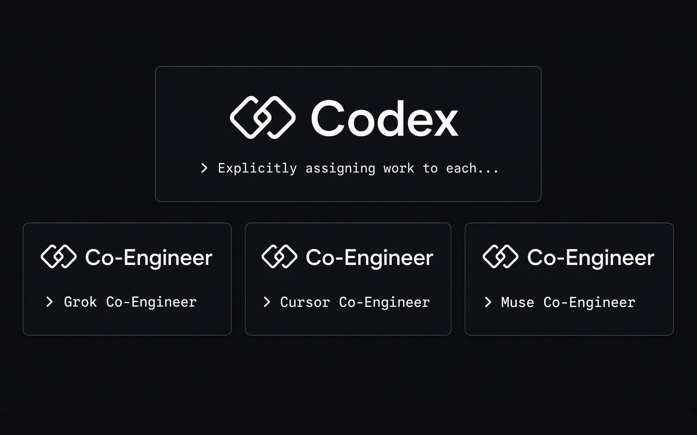

# Codex-Co-Engineer

**Give Codex a team. Keep control of the result.**

[](https://github.com/ajhcs/Codex-Co-Engineer/actions/workflows/ci.yml)
[](https://github.com/ajhcs/Codex-Co-Engineer/releases/latest)
[](https://nodejs.org/)
[](LICENSE)

[Install](#install-and-authentication) · [Try it](#your-first-delegation) · [Providers](#provider-choices) · [Release notes](docs/releases/v3.4.3.md) · [Troubleshooting](#troubleshooting)

[Report a problem](https://github.com/ajhcs/Codex-Co-Engineer/issues/new?template=bug.yml) · [Suggest an improvement](https://github.com/ajhcs/Codex-Co-Engineer/issues/new?template=feature.yml) · [Ask or share a workflow](https://github.com/ajhcs/Codex-Co-Engineer/issues/new?template=question.yml) · [Contribute](CONTRIBUTING.md)

Ask Codex to bring in **Grok, Cursor, or Muse** for implementation, investigation,
or a second opinion. Co-Engineer prepares isolated workspaces, coordinates up to
**eight independent assignments**, and brings their results back for Codex to review.
You decide what ships.

> Use Grok Co-Engineer to review this change. Focus on correctness and regressions.

No hand-written tool payloads. No profile required for an ordinary launch.
Choose a provider, describe the work, and keep talking in the same Codex task.

<!-- README_ART_SLOT: hero-demo -->



*Architecture illustration, not a live screenshot. There is no autoplay audio.*

## What makes it useful

| You want to… | Co-Engineer handles… |
| --- | --- |
| Get another model's perspective | Explicit Grok, Cursor, and Muse assignments using your provider accounts |
| Work on several independent changes | A separate managed Git worktree and branch for each local assignment |
| Keep Codex focused | One submission, coordinated waits, compact results, and details on demand |
| Continue after a disconnect | Durable task identities and receipts; accepted prompts are never blindly replayed |
| Avoid repeated setup decisions | Existing provider choices and optional remembered repository/provider approval |
| Review before integrating | Retained branches, output, and handoffs for Codex to inspect |

**New in 3.4.3:** external ownership through bounded corrections, truthful
result evidence, deadline-governed ACP turns, and the onboarding / contributor
package. Automated checks and independent code review passed. Measured workload
reduction, clean-agent onboarding, and refreshed native-host acceptance remain
unverified; no savings claim is made. Read the [detailed release notes](docs/releases/v3.4.3.md)
and historical [3.4.2 notes](docs/releases/v3.4.2.md) for compatibility and limits.

## Install and authentication

### 1. Check your host

You need **Node.js 24+**, **Git**, **Python 3.11+** for the bundled setup, and a
current **Codex CLI** with plugin support.
Local Grok, Cursor, and Muse also require **Linux**, a working `systemd --user`
manager, `systemd-run` 244+, and unified cgroup v2.
Cursor Cloud runs remotely and does not require that local process boundary.

Install the CLI and account access for **only the providers you plan to use**.
The provider table below separates these requirements. Co-Engineer does not
install or sign you into Grok or Cursor.

### 2. Install 3.4.3

```bash
git clone --branch v3.4.3 --single-branch https://github.com/ajhcs/Codex-Co-Engineer.git Codex-Co-Engineer-3.4.3
cd Codex-Co-Engineer-3.4.3
npm --prefix plugins/codex-co-engineer run setup
codex plugin marketplace add "$PWD"
codex plugin add codex-co-engineer@codex-co-engineer
npm --prefix plugins/codex-co-engineer run setup:check
```

### 3. Keep installation identity consistent

The public release keeps the marketplace identity `codex-co-engineer`.
Keep the clone as its registered marketplace source. Finish or cancel active
runs before replacing an installed version. For an existing installation,
remove `codex-co-engineer@codex-co-engineer` with `codex plugin remove` before
adding it again from the new source. Preserve provider login files and durable
task state.

If older open projects still use that public marketplace identity, use a
distinct local marketplace wrapper outside the tracked release, with the
unchanged plugin name and exact released plugin bytes. Remove/re-add alone is
not sufficient: opening an older project can replace the same-name cache again.
Do not rename the shipped marketplace manifest to solve a local collision.
Prefer a clean Codex environment for onboarding. See the
[release notes](docs/releases/v3.4.3.md) for upgrade details and qualification
limits.

Setup installs pinned ACPX, Cursor SDK, and DSH dependencies globally and creates
key-free DSH configuration. It preserves existing compatible configuration and
reports incompatible profiles instead of overwriting them. Use a user-writable
npm global prefix on your `PATH`; a Node version manager is one way to provide it.

`setup:check` checks Node/Python prerequisites, installed dependencies, and DSH
configuration. Provider login and the running MCP process's Linux boundary are
checked separately by `status`. The worktree tool is bundled; no separate
`worktree-bootstrap` installation is needed.

### 4. Connect your chosen provider

| Provider | One-time authentication | Runs where? |
| --- | --- | --- |
| **Grok** | Install [Grok Build](https://docs.x.ai/build/overview), then run `grok login` (or `grok login --device-auth` when a browser is unavailable). Subscription login only; no API key is required for a Grok first outcome. | Local managed worktree |
| **Cursor Local** | Install [Cursor CLI](https://cursor.com/docs/cli/installation), then run `cursor-agent login` | Local managed worktree |
| **Cursor Cloud** | Configure `CURSOR_API_KEY` or an owner-only key file; see [configuration](docs/configuration.md#cursor-cloud) | Cursor's remote environment |
| **Muse** | From this clone, run `plugins/codex-co-engineer/bin/set-model-api-key` to save your OpenRouter key | Local DSH managed worktree |

Muse defaults to **Muse Spark 1.3 Contributor, XHigh, through OpenRouter**.
Provider credentials stay in normal login state, environment variables, or
owner-only key files. Never paste them into task prompts or MCP arguments.

### 5. Start a new Codex session

For a first route, use **one** provider. Grok is the default walkthrough:

> Show Co-Engineer status, then use Grok Co-Engineer to review the latest change.

The first repository-sharing form offers **this run only** or **remember access
for this repository and the selected providers**. Remembered access works across
linked worktrees. Adding a provider or changing the repository origin requires a
new decision. [Inspect or revoke remembered access](plugins/codex-co-engineer/README.md#remembered-repository-consent).

<details>
<summary>See the installation overview</summary>

<!-- README_ART_SLOT: install-auth -->



</details>

## Your first delegation

Start with [one provider and a small useful outcome](docs/co-engineer-quickstart.md).
The [copyable example](examples/first-outcome/) in the 3.4.3 source includes a
fixed local acceptance check. It is also available directly from the
[v3.4.3 tag](https://github.com/ajhcs/Codex-Co-Engineer/tree/v3.4.3/examples/first-outcome).

> Use Grok Co-Engineer to review the authentication changes. Report actionable findings.

Codex submits the assignment, Co-Engineer prepares its workspace, and the provider
runs. Codex then reads the result and checks the supporting evidence. A launch
acknowledgement is not a completed review.

<details>
<summary>See a single-assignment walkthrough</summary>

<!-- README_ART_SLOT: first-delegation -->



</details>

### Several independent assignments

> Use Grok for the API validator and Muse for the operator guide. Give them separate workspaces.

<!-- README_ART_SLOT: multi-lane-run -->

Independent assignments stay isolated. Assign work that can proceed independently;
ask for a review of the resulting changes after the implementation is available.

If neither your provider preferences nor a named provider resolves the choice,
Codex asks which one to use. It does not silently choose a different provider or model.

### Continue, answer, or cancel

> Chat with Co-Engineer: show the current result.
>
> Use the stricter validation option.
>
> Cancel that Co-Engineer run.

<!-- README_ART_SLOT: grouped-attention -->

One grouped decision covers every assignment that asked; unaffected assignments
can keep working. That answer is chatting with the existing run, not a new launch.
Chatting requires an existing run. Ask for a correction to a reviewed candidate
to return the findings to its external owner. Unrelated new work remains an
explicit delegation.

<!-- README_ART_SLOT: verified-final-decision -->

The verified result is an evidence packet: the changes, branch, tests, and review
that support Codex's decision. It does not automatically merge your code.

If a required assignment fails, Codex reports the gap and available recovery steps.
It does not describe an incomplete run as a verified result.

<details>
<summary>What a failed or unresolved assignment means</summary>

<!-- README_ART_SLOT: failure-unresolved -->



</details>

## Autonomous engineering ownership

The revision operation and result reporting require 3.4.3 or newer.
The budgeted comparison cohort and remaining host qualification stay open;
see the [release notes](docs/releases/v3.4.3.md) and [scope and roadmap](docs/roadmap.md).

Give Grok or Cursor the complete bounded assignment: relevant preparation,
implementation, meaningful checks, and requested corrections. Use an independent
external review where useful; Codex retains final review and integration authority.
Co-Engineer derives revision identities and concise candidate evidence so the
lead agent can make decisions without rebuilding routine dispatch paperwork.

Provider preferences are explicit and preserve a directly selected provider.
They do not infer subscription balances or silently replace an active worker.
The [autonomous ownership guide](plugins/codex-co-engineer/skills/delegate-to-co-engineer/references/autonomous-ownership.md)
explains how this reduces coordination work for Astra and other capable agents.
Measure total native-agent work per accepted result, including any native helpers.
Read the [actual development correction case](docs/demos/ownership-deadline.md),
[result and usage guide](docs/run-results.md), and [comparison protocol](benchmarks/).

## Provider choices

Use your preferred providers for the work at hand. Grok and Cursor keep their
configured provider model; unsupported overrides fail before launch. Muse uses
its configured DSH profile. Provider selection is explicit, and an assignment's
role is an instruction to a trusted coding agent, not a filesystem sandbox.

<details>
<summary>Grok, Cursor, and Muse at a glance</summary>

<!-- README_ART_SLOT: provider-choices -->



</details>

For Codex itself, use one task owner and add workers when useful. Luna, Terra,
Sol, and Astra can cover different scopes; a second coordinator is optional.
The [model-role guide](plugins/codex-co-engineer/skills/delegate-to-co-engineer/references/model-roles.md)
separates practical suggestions from official model documentation. Co-Engineer
does not change your Codex model, reasoning effort, or experimental settings.

## Upgrade to 3.4.3

Finish or cancel active runs first. Preserve dirty development checkouts and
use a clean clone of `v3.4.3`, following the installation instructions above.
Keep the registered source and local marketplace identity consistent; older
open projects with the same identity can replace the shared plugin cache.
Use a distinct local wrapper when required, preserving the public manifest and
exact released plugin bytes.

Start a new Codex session, then check Co-Engineer status. Use the identity from
`codex plugin list` if it differs. Verify project-scoped discovery and installed
file persistence after a connection restart. Existing task receipts and provider
accounts are retained. Direct Meta Muse profiles require the unchanged
OpenRouter migration; see the [upgrade notes](docs/releases/v3.4.3.md#upgrading)
and historical [3.4.2 notes](docs/releases/v3.4.2.md#upgrading).

## Troubleshooting

| Symptom | Next step |
| --- | --- |
| Plugin tools are missing | Start a new Codex session after installation; check `codex plugin list` |
| Local provider is unavailable | Ask for Co-Engineer status; inspect `local_boundary` and the named missing dependency |
| Setup reports an incompatible Muse profile | Follow the OpenRouter migration in the release notes; keep a backup of your configuration |
| Repeated repository-sharing prompts | Choose remembered access; confirm the provider and repository origin have not changed |
| Installed files disappear or an old version returns | Check for another local marketplace using the same identity; when older open projects share the public identity, use a distinct local marketplace wrapper outside the tracked candidate (unchanged plugin name and exact tested bytes), verify `plugin/list` after a connection restart, or use a separate clean Codex environment |
| Cursor Cloud cannot see a commit | Push the exact SHA and make the branch visible through an open PR or the default branch |
| No extra panel appears | Continue in the conversation; the CLI workflow is complete without an optional host UI |

More detail: [troubleshooting](docs/co-engineer-troubleshooting.md) ·
[configuration](docs/configuration.md) · [quickstart](docs/co-engineer-quickstart.md).

## Control and data handling

External workers may commit within their assigned scope. Publication and merge require user authorization and Codex review.

You authorize the repository and providers. Codex reviews the result and integrates
only the work you approve. Provider agents can use their normal coding tools,
shell, network, and authenticated accounts; **Co-Engineer is not a sandbox**.
Local process control exists to keep workers durable and cancel their descendants.

Repository content and history accessible from the assigned workspace can reach
the selected provider. Task state is retained locally with owner-only permissions.
Managed worktrees remain available for inspection; cleanup is explicit and tied
to the recorded task. Read [Security](SECURITY.md) and
[data handling](docs/data-handling.md) before delegating private repositories.

## For integrators and contributors

The catalog remains exactly `status`, `delegate`, `task`, `tasks`, and
`cancel`. New integrations use the small semantic `run_request`; legacy
single-task calls and full run envelopes remain supported.

| Guide | What it covers |
| --- | --- |
| [Run tool API](docs/run-tool-api.md) | Submission, waits, attention, diagnostics, and cancellation |
| [Plugin reference](plugins/codex-co-engineer/README.md) | Installed-package setup, authentication, and API examples |
| [Configuration](docs/configuration.md) | Providers, credentials, profiles, and host variables |
| [Contributing](CONTRIBUTING.md) | Local commands, compatibility, and review expectations |
| [Support](SUPPORT.md) and [starter tasks](docs/contributor-tasks.md) | Reports, questions, examples, and approachable contributions |
| [Showcase preparation](docs/showcase.md) | A source-backed demonstration and current distribution limits |
| [Release process](docs/release.md) | Exact-candidate qualification and publication |

Co-Engineer keeps coordination compact, but token parity with native subagents
has not been established. The [efficiency guide](docs/efficient-dogfood.md) explains
what to measure. Licensed under [MIT](LICENSE).

Historical [3.4.2 notes](docs/releases/v3.4.2.md), [3.4.0 notes](docs/releases/v3.4.0.md),
and historical 3.3.0 notes in [the release archive](docs/releases/v3.3.0.md) remain available.
